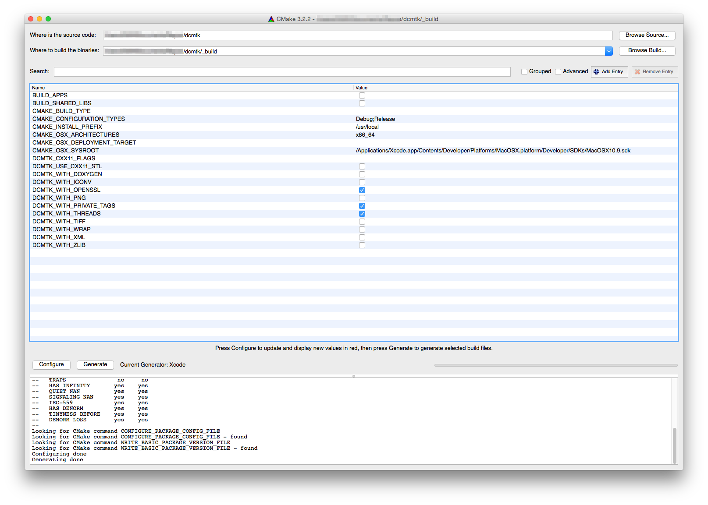
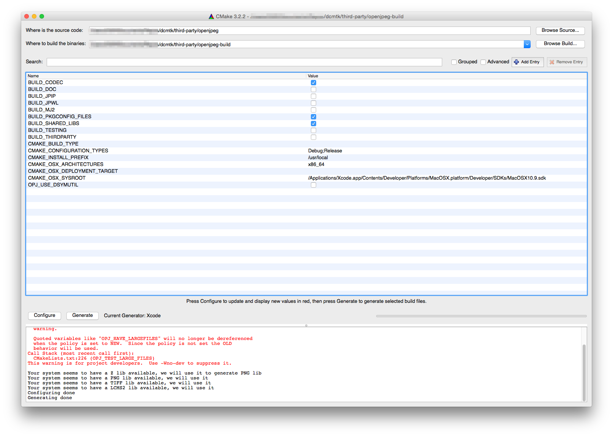
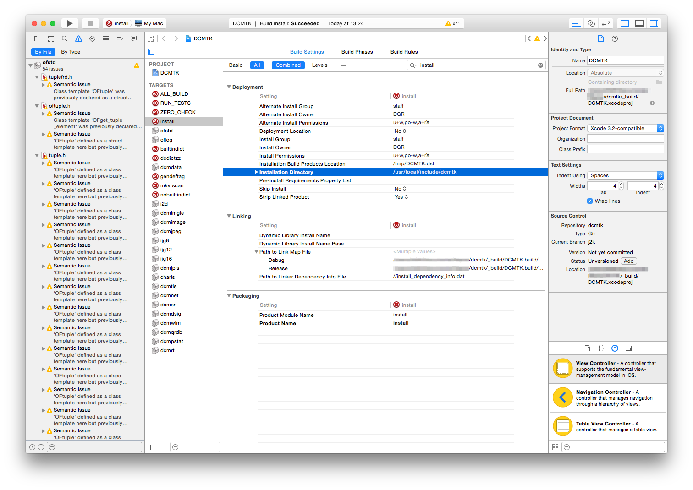

# README
```
$ git clone https://github.com/BYTEPOETS/dcmtk.git

$ cd dcmtk

$ git checkout j2k

$ git submodule update --init --recursive
```

DCMTK custom build with jpeg2000 support for MAC OSX > 10.9

##### Configuration
- download/install [CMAKE](http://www.cmake.org/cmake/resources/software.html) (this readme is based on version 3.2.2)
- start CMAKE and configure source and binaries path to `/dcmtk` and `/dcmtk/_build`, then review configuration:

- once configuration is done hit generate to re-generate build configuration in `/dcmtk/_build`
- same has to be done for openjpeg but important the build folder has to be in `/dcmtk/third-party/openjpeg-build`
- openjpeg configuration:


##### Building
- open `/dcmtk/third-party/openjpeg-build/OPENJPEG.xcodeproj` in Xcode
- select `install`, `package` and run (for Debug build) or build Archive (for Release build)
- open `/dcmtk/_build/DCMTK.xcodeproj` in Xcode
- select `install` and run (for Debug build) or build Archive (for Release build)
- setting for header files


##### Installation / Use in aspd-dicom-framework
- built static libs can be found in `/lib/Debug` or `/lib/Release`
- in case DCMTK was updated to a newer version, the new header files can be found in `/usr/local/include/dcmtk`
- the openjpeg dylib can be found in the `openjpeg-2.1.0-Darwin-x86_64.tar.gz`
- for use in your framework, copy the static libs (and header files, if needed) into your libs folder in your XCODE project where you want to use dcmtk